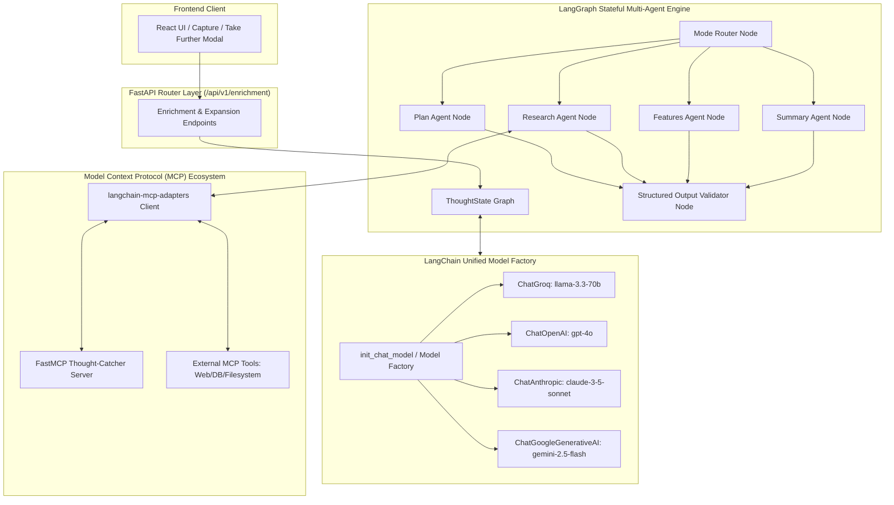

# Migration Plan: LangChain + LangGraph + MCP Multi-Agent Architecture

## Executive Overview
This document outlines the architectural plan to transition Thought-Catcher's AI layer from direct provider API calls to a **LangChain + LangGraph** stateful agentic system with **Model Context Protocol (MCP)** integration via `langchain-mcp-adapters`.

This upgrade enables:
1. **Dynamic Model Switching:** Hot-swapping between Groq (LLaMA 3.3), OpenAI (GPT-4o), Anthropic (Claude 3.5 Sonnet), Google (Gemini 2.5 Flash), or local Ollama instances with zero code changes.
2. **Stateful LangGraph Workflows:** Replacing linear prompt strings with a resilient, cyclical multi-agent graph with validation, fallback retries, and checkpointed state.
3. **Standardized Tool Interoperability via MCP:** Exposing Thought-Catcher tools via an MCP Server (FastMCP) while allowing LangGraph agents to consume external MCP servers (Search, Vector stores, Filesystem) via `langchain-mcp-adapters`.

---

## 1. Target System Architecture



---

## 2. Component Specifications

### 2.1 Unified Model Factory (`app/ai/model_factory.py`)
Provides dynamic model instantiation based on configuration or runtime headers:
- Uses `langchain.chat_models.init_chat_model` or explicit provider adapters (`ChatGroq`, `ChatOpenAI`, `ChatAnthropic`, `ChatGoogleGenerativeAI`).
- Standardizes `.with_structured_output(ExpansionResult)` across all providers for type-safe JSON returns without regex parsing.

```python
from langchain.chat_models import init_chat_model
from langchain_core.language_models.chat_models import BaseChatModel
from app.config import settings

def get_chat_model(model_name: str | None = None, provider: str | None = None, temperature: float = 0.2) -> BaseChatModel:
    model = model_name or settings.DEFAULT_LLM_MODEL or "llama-3.3-70b-versatile"
    model_provider = provider or settings.DEFAULT_LLM_PROVIDER or "groq"
    
    return init_chat_model(
        model=model,
        model_provider=model_provider,
        temperature=temperature
    )
```

### 2.2 LangGraph State & Agent Workflow (`app/ai/langgraph_expansion.py`)
Defines the execution state graph for thought enrichment and expansion:
- **State Schema:**
  ```python
  from typing import TypedDict, List, Literal, Optional
  from pydantic import BaseModel, Field

  class ExpansionResult(BaseModel):
      title: str = Field(..., description="Action-oriented title")
      summary: str = Field(..., description="Executive summary")
      actionable_steps: List[str] = Field(default_factory=list)
      insights: List[str] = Field(default_factory=list)
      suggested_features: List[str] = Field(default_factory=list)

  class ThoughtAgentState(TypedDict):
      raw_text: str
      mode: Literal["plan", "research", "features", "summary"]
      model_override: Optional[str]
      context_docs: List[str]
      result: Optional[ExpansionResult]
      error: Optional[str]
      retry_count: int
  ```

- **Graph Nodes:**
  1. `router_node`: Determines the specialized persona prompt based on `mode`.
  2. `agent_execution_node`: Executes structured LLM generation with automatic MCP tool retrieval if research context is required.
  3. `guardrail_validator_node`: Validates safety, verifies structured fields, and triggers repair loops if incomplete.

### 2.3 Model Context Protocol (MCP) Integration (`app/ai/mcp_service.py`)
Using `langchain-mcp-adapters`:
- **MCP Client Adapter:** Connects to external or internal MCP servers and converts remote tools directly into LangChain `BaseTool` instances for use in LangGraph.
- **Thought-Catcher MCP Server (FastMCP):** Exposes internal application capabilities as standardized MCP tools:
  - `search_user_thoughts(query: str, limit: int = 5)`
  - `get_thought_context(thought_id: str)`
  - `save_expanded_plan(thought_id: str, plan_markdown: str)`

```python
from langchain_mcp_adapters.client import MultiServerMCPClient

async def get_mcp_tools():
    client = MultiServerMCPClient({
        "thought_catcher": {
            "transport": "stdio",
            "command": "python",
            "args": ["-m", "app.mcp.server"]
        }
    })
    return await client.get_tools()
```

---

## 3. Step-by-Step Implementation Roadmap

### Phase 1: Environment & Dependencies
1. Add required libraries to `Backend/requirements.txt`:
   - `langchain>=0.3.0`
   - `langchain-core>=0.3.0`
   - `langgraph>=0.2.0`
   - `langchain-groq>=0.2.0`
   - `langchain-openai>=0.2.0`
   - `langchain-anthropic>=0.2.0`
   - `langchain-mcp-adapters>=0.1.0`
   - `mcp>=1.0.0`
   - `fastmcp>=0.1.0`
2. Configure environment settings in `Backend/app/config.py` for model switching (`DEFAULT_LLM_PROVIDER`, `DEFAULT_LLM_MODEL`, `OPENAI_API_KEY`, `ANTHROPIC_API_KEY`).

### Phase 2: Core Model Factory & MCP Service
1. Implement `Backend/app/ai/model_factory.py` with multi-provider dynamic dispatch and fallback handling.
2. Implement `Backend/app/ai/mcp_service.py` with client connection management and tool loading.
3. Build `Backend/app/mcp/server.py` exposing thought-search and storage tools via FastMCP.

### Phase 3: LangGraph State & Agent Nodes
1. Implement `Backend/app/ai/langgraph_expansion.py` containing:
   - State definitions (`ThoughtAgentState`).
   - Mode-specific agents (Planner, Researcher, Product Architect, Summarizer).
   - Guardrails & JSON repair integration.
   - Compiled `StateGraph` runnable with `.ainvoke()`.

### Phase 4: Non-Destructive API Integration
1. Update `Backend/app/services/enrichment_service.py` and `Backend/app/api/v1/enrichment.py` to route through the LangGraph engine while maintaining 100% backwards compatibility with existing frontend request/response formats.
2. Ensure telemetry records (`AITelemetryRecord`) and audit logs continue tracking tokens and latency seamlessly.

### Phase 5: Verification & Testing
1. Unit test dynamic model switching (Groq $\leftrightarrow$ Fallback $\leftrightarrow$ Custom).
2. Test LangGraph execution across all 4 modes (`plan`, `research`, `features`, `summary`).
3. Verify MCP tool execution within the research agent.
4. Validate frontend integration with `TakeFurtherModal.tsx`.
